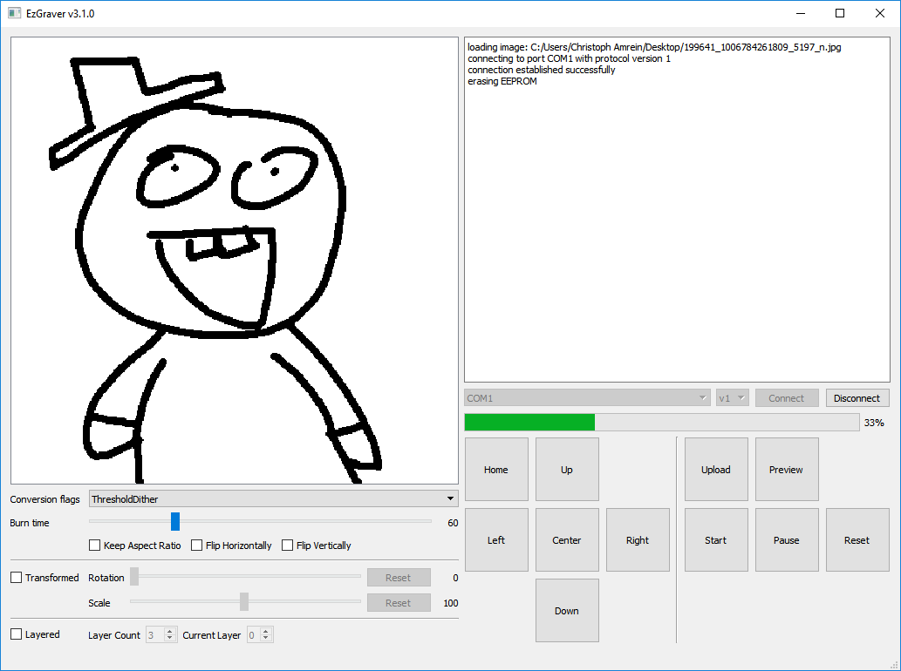

| Linux / OSX | Windows | Latest |
|-------------|---------|---------|
|[](https://travis-ci.org/camrein/EzGraver)|[](https://ci.appveyor.com/project/camrein/ezgraver)|[](https://github.com/camrein/EzGraver/releases/latest)|

# About
EzGraver is an open source software allowing users to use with laser engravers by NEJE. It supports Linux, OSX, and Windows. It provides both a command-line interface and a graphical user interface. The latest release is available on the [releases page](https://github.com/camrein/EzGraver/releases/latest).



# Before Running
On all platforms (Linux, OSX, and Windows), it is required that the proper drivers are installed. If that's not the case, the engraver will not be detected and not listed in the dropdown. There were reports (at least for Windows) that the [Arduino](https://www.arduino.cc/en/Main/Software) drivers are working.

Additionally, Windows requires the installation of [Visual C++ Redistributable for Visual Studio 2015](https://www.microsoft.com/en-us/download/details.aspx?id=48145) too. Otherwise, errors like *VCRUNTIME140.dll* or *MSVCP140.dll* could not be found will be shown.

Linux may require running EzGraver with extended privileges. This possibly identifies itself with a *permission denied* error. To gain access to the serial device, add the user to the group of allowed serial port users (*dialout* for Ubuntu).

# Command-Line Interface
Besides the graphical user interface, EzGraver provides a pure command-line interface too.
```bash
Usage: EzGraverCli <option> [arguments...]

Available options:
  v - Prints the version information
  a - Shows the available ports
  h <port> - Moves the engraver to the home position
  s <port> - Starts the engraving process with the burn time 60
  p <port> - Pauses the engraver
  r <port> - Resets the engraver
  u <port> <image> - Uploads the given image to the engraver
```

# Building
EzGraver was developed with QT 5.7. The lowest known API-Requirement is [QT 5.4](http://doc.qt.io/qt-5.7/qtimer.html#singleShot-4). Continuous integration on Travis-CI, Tea-CI and AppVeyor is done with at least QT 5.5.

## Windows
Download the latest QT release and build it using QT Creator. Builds have been tested on the following kits:
- Desktop QT 5.7.0 MinGW 32bit
- Desktop QT 5.7.0 MSVC2015 64bit

## OS X
First, install a sufficient QT version. In this example, QT 5.5 is being installed.
```bash
brew update
brew install qt55
brew link --force qt55
```

Now build EzGraver.
```bash
qmake -config release EzGraver.pro
make
```

Copy EzGraverCore into the frameworks directory and then generate the \*.dmg file for deployment.
```bash
mkdir EzGraverUi/EzGraverUi.app/Contents/Frameworks/
cp EzGraverCore/libEzGraverCore.1.dylib EzGraverUi/EzGraverUi.app/Contents/Frameworks/libEzGraverCore.1.dylib
macdeployqt EzGraverUi/EzGraverUi.app -dmg
```


## Ubuntu
Before loading QT from the official Ubuntu repositories, it is recommended to ensure that they contain the required version.
```bash
apt-get install build-essential qt5-qmake qtbase5-dev libqt5serialport5-dev
```

Ensure the desired QT version has been installed.
```bash
qmake -qt=qt5 -v
```

Now build EzGraver.
```bash
qmake -qt=qt5 -config release EzGraver.pro
make
```

Install the binaries.
```bash
make install
```

# Acknowledgment
Many thanks to [Frederik Andersson](https://github.com/Na1w) for reverse engineering the low-level protocol.

